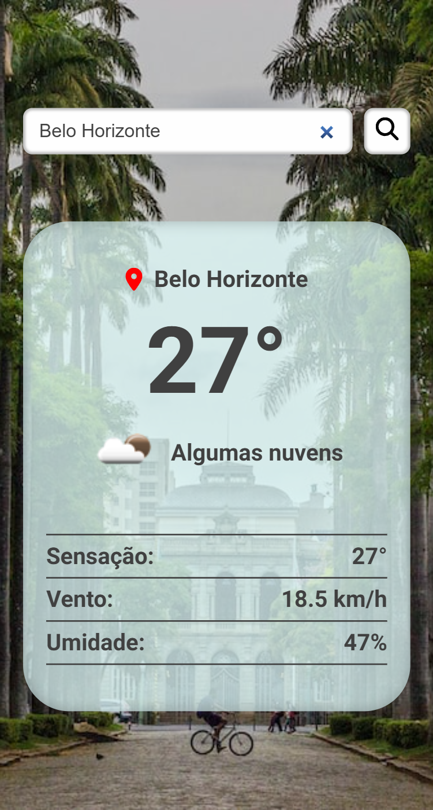

# Aplicativo de Previsão do Tempo

## Índice

- [Resumo](#resumo)
  - [Screenshot](#screenshot)
  - [Links](#links)
- [Processo](#processo)
  - [Construção](#construção)
  - [Aprendizado](#aprendizado)
  - [Recursos](#recursos)
- [Autor](#autor)

<br/>

# Resumo

Este é um aplicativo de previsão do tempo que permite que o usuário obtenha informações precisas sobre o clima de qualquer cidade do mundo. Além disso, o aplicativo também exibe uma imagem da cidade escolhida, melhorando a experiência do usuário. As informações do tempo e as imagens da cidade são obtidas por meio de APIs confiáveis, fornecendo resultados precisos e atualizados em tempo real. Com uma interface amigável e fácil de usar, o aplicativo oferece uma experiência de usuário agradável e intuitiva.

<br/>

## Screenshot

<p style="text-align:center;">
    </img>
</p>

<br>

<p style="text-align:center;">
    </img>
</p>


<br/>

## Links

- [Previsão do Tempo]()

<br/>

# Processo

<br/>

## Construção

Durante a construção deste aplicativo, foram utilizados diversos conhecimentos e técnicas para alcançar os objetivos propostos. Foram aplicados conceitos de programação em JavaScript, como funções assíncronas, manipulação da DOM, além do trabalho com APIs de terceiros.

Para a construção da interface do aplicativo, foram utilizadas técnicas de desenvolvimento front-end, como a metodologia BEM, marcação semântica em HTML e a linguagem Sass/Scss para estilização dos elementos.

Foi realizada a integração com três APIs distintas, incluindo a API de Geocodificação e a API de Tempo Atual do OpenWeatherMap, além da API de Imagens de Cidades do Unsplash. Essa integração permitiu que o aplicativo pudesse exibir informações precisas sobre o clima e imagens das cidades escolhidas pelos usuários.

<br/>

## Aprendizado

*Ao desenvolver este aplicativo, tive a oportunidade de aprimorar minha habilidade em trabalhar com APIs, além de aprofundar meus conhecimentos em manipulação de objetos e validação de entrada de usuário para melhorar a experiência do usuário. No trecho de código apresentado, é possível observar a utilização da API de geocodificação do [OpenWeatherMap](https://openweathermap.org/api/geocoding-api) para obter as coordenadas da cidade digitada pelo usuário. Caso a cidade não seja encontrada ou a resposta da API seja vazia, é lançado um erro para alertar o usuário. Caso contrário, as informações são armazenadas em um objeto para serem utilizadas posteriormente.*

<br/>

```javascript
export async function getCoordinates(city) {
  const geocodingAPI = await fetch(
    `http://api.openweathermap.org/geo/1.0/direct?q=${city}&appid=${weatherAccessKey}`
  );

  const data = await geocodingAPI.json();

  if (!data || data.length === 0) {
    throw new Error(
      "Cidade não encontrada. Por favor, verifique o nome digitado."
    );
  } else {
    const cityData = {
      name: data[0].name,
      country: data[0].country,
      lat: data[0].lat,
      lon: data[0].lon,
    };
    return cityData;
  }
}
```

<br/>

## Recursos

### Aqui estão alguns links para documentação relevante que podem ajudar no entendimento dos métodos utilizados no código

- [try...catch](https://developer.mozilla.org/pt-BR/docs/Web/JavaScript/Reference/Statements/try...catch)
- [await fetch](https://developer.mozilla.org/pt-BR/docs/Web/API/Fetch_API/Using_Fetch)
- [Documentação sobre objetos](https://developer.mozilla.org/pt-BR/docs/Web/JavaScript/Guide/Trabalhando_com_Objetos)
- [charAt()](https://developer.mozilla.org/pt-BR/docs/Web/JavaScript/Reference/Global_Objects/String/charAt)
- [slice()](https://developer.mozilla.org/pt-BR/docs/Web/JavaScript/Reference/Global_Objects/String/slice)
- [toUpperCase()](https://developer.mozilla.org/pt-BR/docs/Web/JavaScript/Reference/Global_Objects/String/toUpperCase)
- [toLowerCase()](https://developer.mozilla.org/pt-BR/docs/Web/JavaScript/Reference/Global_Objects/String/toLowerCase)
- [toFixed()](https://developer.mozilla.org/pt-BR/docs/Web/JavaScript/Reference/Global_Objects/Number/toFixed)
- [Math.round()](https://developer.mozilla.org/pt-BR/docs/Web/JavaScript/Reference/Global_Objects/Math/round)

### Foram utilizadas as seguintes APIs

- [API de Geocodificação do OpenWeatherMap](https://openweathermap.org/api/geocoding-api)
- [API de Tempo Atual do OpenWeatherMap](https://openweathermap.org/current)
- [API de Imagens de Cidades do Unsplash](https://unsplash.com/documentation)

<br/>

# Autor

<div align="center">

[](<https://www.linkedin.com/in/mathewsmattar/>)
[](<mailto:mathmattar@hotmail.com>)

</div>
